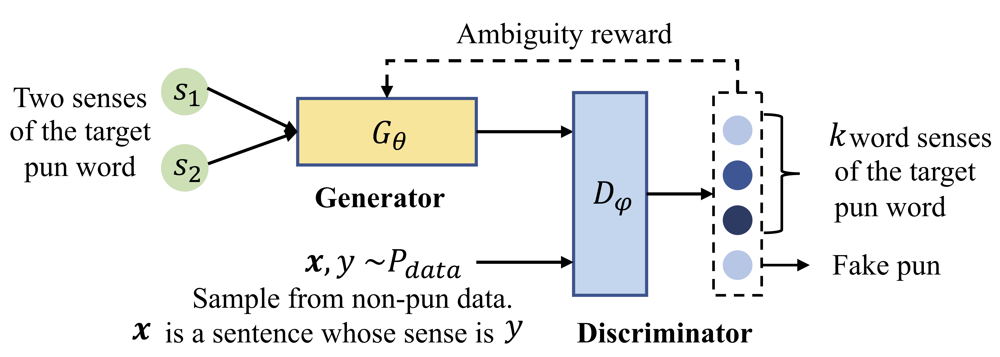

# Pun-GAN: Generative Adversarial Network for Pun Generation

This repo contains code for the following paper.

"Pun-GAN: Generative Adversarial Network for Pun Generation". Fuli Luo, Shunyao Li, Pengcheng Yang, Lei Li, Baobao Chang, Zhifang Sui and Xu SUN. EMNLP 2019.

In this paper, we focus on the task of generating a pun sentence given a pair of word senses. A major challenge for pun generation is the lack of large-scale pun corpus to guide the supervised learning. To remedy this, we propose an adversarial generative network for pun generation (Pun-GAN). It consists of a generator to produce pun sentences, and a discriminator to distinguish between the generated pun sentences and the real sentences with specific word senses. The output of the discriminator is then used as a reward to train the generator via reinforcement learning, encouraging it to produce pun sentences which can support two word senses simultaneously.



## Quick Start

1. Pretrain pun generation model, which can be divided into two parts: backward and forward.

```bash
# pretrain backward model
cd ./Pun_Generation/code

python -u nmt.py
--infer_batch_size=64
--out_dir=backward_model_path
--sampling_temperature=0
--pretrain=1 > output_backward.txt
```

```bash
# pretrain forward model
cd ./Pun_Generation_Forward/code

python -u nmt.py
--infer_batch_size=64
--out_dir=forward_model_path
--sampling_temperature=0
--pretrain=1 > output_forward.txt
```

2. Pretain word sense disambiguation(WSD) model.

```bash
cd ./WSD/BiLSTM

python train.py
```

3. Train Pun-GAN.

```bash
sh train.sh
```

4. Inference.

```bash
sh inf.sh
```

## Data Format

Sense pairs are required for pun generation. We prepare senses by keys in WordNet and store them in /Pun_Generation/data/samples.

```
rich%3:00:00::
rich%5:00:00:unwholesome:00
pump%1:06:01::
pump%2:32:00::
cleanly%4:02:00::
cleanly%4:02:02::
umbrella%1:06:00::
umbrella%1:04:01::
revealing%5:00:00:informative:00
reveal%2:39:00::
partial%5:00:00:inclined:02
partial%5:00:00:incomplete:00
```

## Dependencies

```
python2.7
tensorflow_gpu==1.4.1
numpy==1.14.2
nltk==3.2.5
```


